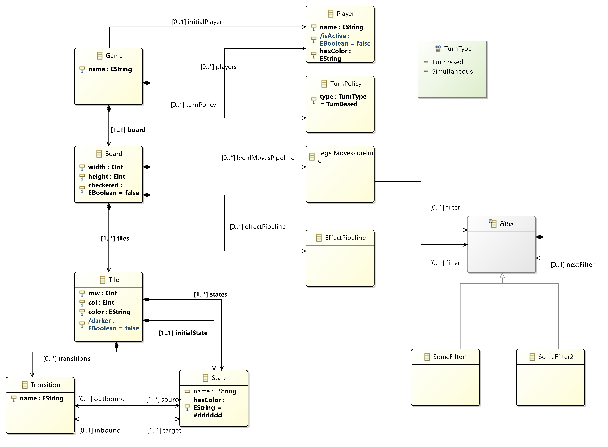

# Tile-Based Game Engine - Project Overview

This repository allows you to design tile-based games such as Connect 4, Gomoku and TicTacToe using a custom DSL, generate runnable code, and execute the game **with no additional hard-coded logic**. Everything is defined in the model. 
The project was created by *Emil Johnsen*, *Frikk Balder Ormestad*, *Andread Gjerstøe*, *Knut Johansen*.

The code generation is built on **EMF/Ecore**, **Java**, **Xtend** and **Xtext**. Generated code results in a runnable **Python** file, which can be used in our **Python** and **React** application to play a game defined according to the DSL.

---

## Table of Contents

- [Project description](#project-description)  
- [How to setup and use](#how-to-setup-and-use)  
- [Repository Overview](#repository-overview)  
- [Tile-Based Game Engine Deep Dives](#tile-based-game-engine-deep-dives)  
  - [Metamodel Deep Dive](#metamodel-deep-dive)  
    - [Classes and Relationships](#classes-and-relationships)  
    - [State Machines](#state-machines)  
    - [Pipelines](#pipelines)  
    - [Filters](#filters)  
    - [Constraints](#constraints)
    - [Derived Attributes](#derived-attributes)  
  - [Generated Code Deep Dive](#generated-code-deep-dive)  
  - [Game Logic Flow Deep Dive](#game-logic-flow-deep-dive)  
- [Example Game: Connect 4](#example-game-connect-4)  
- [Example Game: Othello](#example-game-othello)  

---

## Project description

The **Tile-Based Game Engine** is a model-driven framework for defining deterministic, grid-based games. All gameplay logic is modeled inside the **Ecore model** using:

- Tile state machines  
- Filters 
- Legal and effect pipelines, consisting of a chain of filters
- State transitions  
- Constraint validation

Games such as **Connect 4**, **TicTacToe**, or other grid-based logic games can be created easily without the need of implementing code yourself.

**Metamodel**: Contains classes for `Tile`, `State`, `Transition`, `Board`, `Game`, `Player`, `Pipelines`, `Filters`, etc. Constraints are implemented in Java inside the generated `Validator`.

**Pipelines**:

- `LegalMovesPipeline` decides if a tile is a valid move.  
- `EffectPipeline` decides what happens when a tile is played.  
- **Filters** are reusable logic units. Pipelines are built by chaining filters.

All logic is declarative - you create games by assembling pipelines and transitions in the model.

---

## How to setup and use (THIS PART IS JUST TEMPORARY, FIX WHEN WE HAVE FIGURED THIS OUT)

1. Import the project into **Eclipse with EMF support**.  
2. Open the `.ecore` metamodel.  
3. Right-click the `.genmodel` → **Generate Model Code**.  
4. Create a game instance (`.xmi` / `.model`).  
5. Define the following in your instance model:
   - `Board`
   - `Players`
   - `Tiles`
   - `States`
   - `State transitions`
   - `LegalMovesPipeline`
   - `EffectPipeline`
6. Implement filter logic in `impl` classes (mark them `@generated NOT` for custom logic).  
7. Validate the model: right-click instance → **Validate**.  
8. Run the generated engine.

---

## Repository Overview (COMPLETE THIS WHEN FINISHED WITH XTEND AND XTEXT)

- `no.ntnu.tdt4250.bg/model` → Ecore metamodel
- `no.ntnu.tdt4250.bg/src-gen/no/ntnu/tdt4250/bg/util` → Validator
- `no.ntnu.tdt4250.bg.bgdsl/src/no/ntnu/tdt4250/bg/bgdsl` → Xtext grammar
- `no.ntnu.tdt4250.bg.bgdsl/src/no/ntnu/tdt4250/bg/bgdsl/generator` → Xtend Python generator file
- cont...
- `README.md` → This documentation file

---

## **Tile-Based Game Engine Deep Dives**

### **Metamodel Deep Dive**

The following is a detailed description of the latest version of the Tile-Based Game Engine metamodel.

#### **Classes and Relationships**

The following diagram shows the complete structure of the Tile-Based Game Engine metamodel.  
It includes the core game entities (Game, Board, Tile), tile state machines, pipelines, filters, and pattern-based match logic used to determine legal moves and apply effects during gameplay.

 TODO oppdatere?

---

### **Class Descriptions**

---

### **Game**
Represents a complete, fully defined playable game configuration.

- **`name : EString`**  
  The name of the game (e.g., “Connect 4”, “Othello”).

- **`players : Player[*]`**  
  All players participating in the game.

- **`board : Board`**  
  The board on which the game is played.

- **`initialPlayer : Player[0..1]`**  
  Defines which player begins the game.

- **`activePlayer : Player[1..1]`**  
  The player whose turn is currently active.

---

### **Player**
Represents a participant in the game.

- **`name : EString`**  
  The display name of the player.

- **`hexColor : EString`**  
  Hex color representing the player's pieces (e.g., `#FF0000`).

- **`associatedState : State[1..1]`**  
  The state instance that represents this player's pieces (each player has exactly one associated State).

---

### **Board**
Defines the tile grid used by the game.

- **`width : EInt`**  
  The number of columns on the board.

- **`height : EInt`**  
  The number of rows on the board.

- **`checkered : EBoolean = false`**  
  Optional rendering rule enabling alternating light/dark tiles.

- **`tiles : Tile[1..*]`**  
  All possible tiles for the game.

- **`legalMovesPipeline : LegalMovesPipeline[0..*]`**  
  Pipeline that determines which tiles are legal moves for the current player.

- **`effectPipeline : EffectPipeline[0..*]`**  
  Pipeline that applies tile changes and game effects after a move is executed.

- **`tileplacement : TilePlacement[1..*]`**  
  Placement metadata for tiles.

---

### **TilePlacement**

Represents the position and rendering hints for a tile.

- **`row : EInt`**  
  Row position (0-based).

- **`column : EInt`**  
  Column position (0-based).

- **`tile : Tile[1..1]`**  
  The tile placed at this location.

---

### **Tile**
Represents a single grid cell on the board.

- **`type : EString`**  
  Category or type label for the tile.

- **`hexColor : EString`**  
  The color of the tile, for UI purposes.

- **`name : EString`**  
  The name of the tile.

- **`initialState : State[1..1 ]`**  
  The tile's initial state, every tile must have an initial state.

- **`states : State[1..*]`**  
  All valid states this tile can take.

- **`transitions : Transition[0..*]`**  
  The state machine transitions allowed for this tile.

---

### **State**
Represents a specific possible tile condition.

- **`name : EString`**  
  The name of the state (e.g., “empty”, “red”, “white”).

- **`hexColor : EString = #dddddd`**  
  The state's visual color, defaulting to light gray.

- **`(reverse) matchState : Pattern[0..1]`**  
  Patterns may reference this state.

---

### **Transition**
Defines how a tile may change from one state to another.

- **`name : EString`**  
  The name of the transition.

- **`outbound : State`**  
  The current state before the transition.

- **`inbound : State`**  
  The new state after applying the transition.

Transitions always occur **within the same tile**.

---

### LegalMovesPipeline

A chain of filters used to determine valid moves.

- **`filter : Filter[0..1]`**  
  First filter in the chain.

---

### EffectPipeline

A chain of filters used to apply post-move effects.

- **`filter : Filter[0..1]`**  
  First filter in the chain.

---

### **Filter**
An abstract class with reusable logic units that form part of a pipeline's chain.

- **`nextFilter : Filter[0..1]`**  
  The next filter in the sequence. If null, this filter is the final step.

---

### PatternFilter

Uses patterns to evaluate tile configurations.

- **`name : EString`**
  The name of the pattern filter.

- **`patterns : Pattern[1..*]`**  
  Set of patterns to check.

---

### Pattern

Describes a spatial arrangement to match against tiles.

- **`name : EString`**  
  Pattern name.

- **`stateSelection : StateSelection = CurrentPlayer`**  
  Determines how states are matched.

- **`Enum StateSelection`**: 
- CurrentPlayer  
- OtherPlayer  
- State

- **`relativecoordinates : RelativeCoordinate[1..*]`**  
  Tile offsets relative to an anchor tile.

- **`matchState : State[0..1]`**  
  The exact state to match when `stateSelection = State`.

---

### RelativeCoordinate

Coordinate relative to a pattern anchor.

- **`x : EInt`**  
  Horizontal offset.

- **`y : EInt`**  
  Vertical offset.

---

#### State Machines

- Each `Tile` contains its own small state machine.
- Example transition:
  - **Connect 4**:
    - `Empty → Red`
    - `Empty → Yellow`
- Transitions are used by effect filters to apply gameplay actions.

#### Pipelines

- **LegalMovesPipeline**
  - Determines whether a tile is a legal move.
  - Runs a chain of filters until one returns `false`.

- **EffectPipeline**
  - Runs after a legal tile is selected.
  - Applies state transitions, flips, gravity, win checking, turn switching.

- Both pipelines are modeled as linked lists of `Filter`s.

#### Filters

- Reusable logic building blocks chained to form pipelines.
- Here are some example filters: (Change this to use pattern filter instead?)
  - `TileEmptyFilter` - tile must be empty
  - `GravityFilter` - Connect 4 gravity rule
  - `ImmediateNeighbourFilter` - Othello edge rule
  - `RaycastFilter` - scans lines for Othello
  - `PlaceTileEffect` - set tile state
  - `FlipTilesEffect` - flips Othello discs
  - `NextTurnEffect` - switch player turn
  - `CheckWinEffect` - detect winner

## Constraints

- Implemented in the generated `Validator` using Java.

---

### **Game constraints**

- **`playersMustHaveUniqueHexColors`**  
  Ensures that no two players share the same `hexColor`, guaranteeing a unique visual identity for each player.

- **`playersMustHaveUniqueNames`**  
  Ensures that every player in a game has a distinct name to avoid ambiguity in UI and rule processing.

- **`gameMustHaveAtLeastOnePlayer`**  
  Prevents creation of a game without players; every valid game must include at least one participant.

---

### **Board constraints**

- **`tilePositionsMustBeUnique`**  
  Ensures that no two `TilePlacement` instances occupy the same `(row, column)` coordinate within a board.

- **`boardDimensionsMustBePositive`**  
  Validates that both `width` and `height` are greater than zero, preventing invalid board sizes.

- **`tilesInsideBoardBounds`**  
  Ensures that all `TilePlacement` coordinates lie within the board’s width and height.

- **`boardMustBelongToGame`**  
  Ensures every board is associated with exactly one game, preventing orphaned boards.

---

### **Tile constraints**

- **`tileMustHaveInitialState`**  
  Validates that each tile defines exactly one `initialState`, ensuring a deterministic starting point.

- **`stateNamesUniqueWithinTile`**  
  Ensures all states within a tile have unique names, preventing ambiguity when transitions reference them.

---

### **TilePlacement constraints**

- **`tilePlacementMustBelongToBoard`**  
  Ensures each `TilePlacement` is contained within a `Board`.

- **`rowAndColumnMustBeNonNegative`**  
  Ensures `row` and `column` coordinates are never negative.

- **`rowAndColumnMustBeWithinBoardBounds`**  
  Verifies that the placement’s coordinates fit inside the board dimensions.

- **`tileMustBeSet`**  
  Ensures that every `TilePlacement` references a valid `Tile` (no empty placements).

---

### **State machine constraints**

- **`allStatesMustBeReachable`**  
  Ensures every state inside a tile can be reached from the tile’s `initialState`.

- **`transitionMustStayWithinTile`**  
  Validates that all transition source and target states belong to the same tile, preventing cross-tile transitions.

- **`stateHexColourMustBeValid`**  
  Confirms that the `hexColor` attribute follows the `#RRGGBB` pattern.

---

### **Pipeline constraints**

- **`legalPipelineMustBeValidChain`**  
  Ensures the legal-moves pipeline forms a properly linked, acyclic chain of filters.

- **`effectPipelineMustBeValidChain`**  
  Same as above, but applied to the effect pipeline; ensures effects execute in the intended order.

---

## Derived Attributes

- Implemented in the generated `*Impl` classes using Java (`@generated NOT` getters).
- All derived attributes in the Ecore model are declared with:
  - `derived = true`
  - `volatile = true`
  - `changeable = false`

  This ensures they are computed dynamically and never stored in the underlying model.

---

### **Board derived attribute**

- **`/size`**  
  Computes the total number of addressable cells on the board using `width * height`.  

---

### **TilePlacement derived attributes**

- **`/darker`**  
  Determines whether the tile position should be visually rendered as a dark-colored square on checkered boards.  
  Computed using `(row + column) % 2 == 1` when `Board.checkered` is enabled.

- **`/coordinate`**  
  Provides a human-readable coordinate for the tile placement in the format: `(row, column)`.  

---

### Game Logic Flow Deep Dive

1. `LegalMovesPipeline` identifies allowed tiles.  
2. User selects a tile.  
3. `EffectPipeline` applies the tile's effects:
   - state transition
   - flips (if applicable)
   - gravity (if applicable)
   - win checking
   - turn switching  
4. Game updates model state.  
5. Everything remains model-driven - the engine interprets the model and executes pipelines/filters/transition logic.

---

## Example Game: Connect 4

- **Board**
  - `width = 7`
  - `height = 6`

- **States**
  - `empty`
  - `red`
  - `yellow`

- **Transitions**
  - `empty → red`
  - `empty → yellow`

- **LegalMovesPipeline**
  - `TileEmptyFilter` → `GravityFilter`

- **EffectPipeline**
  - `PlaceTileEffect` → `CheckWinEffect` → `NextTurnEffect`

---

## Example Game: Othello

- **States**
  - `empty`
  - `black`
  - `white`

- **Transitions**
  - `empty → white`
  - `empty → black`
  - `white → black`
  - `black → white`

- **LegalMovesPipeline**
  - `TileEmptyFilter` → `ImmediateNeighbourFilter` → `RaycastFilter` → `OpponentColorFilter`

- **EffectPipeline**
  - `PlaceTileEffect` → `FlipTilesEffect` → `NextTurnEffect`

---

## Extensibility & Future Work (This can probably be removed)

- Sirius diagram for pipeline visualization  
- Composite filters (AND/OR filter nodes)  
- AI players modeled as pipelines  
- Additional board shapes (hex, wrap-around)  
- Undo/redo via reversible effects  
- Animation / rendering hooks  
- Export playable games to external platforms

---

## Quick Start Checklist (Need to redo this with serious probably)

- [ ] Install Eclipse with EMF support  
- [ ] Open `model/` (`.ecore`) and review metamodel  
- [ ] Generate model code from `.genmodel`  
- [ ] Create or modify example models in `models/`  
- [ ] Implement custom filters/effects in `src/.../impl` (mark `@generated NOT`)  
- [ ] Validate models and run generated engine

---

## Notes

- All gameplay logic is stored in the model - the generated engine interprets and executes it.  
- Custom Java is only required for filter/effect implementations and validator code that cannot be expressed in the model.  
- The engine is intended for deterministic, grid-based games; extensions can enable other board geometries and features.

---
